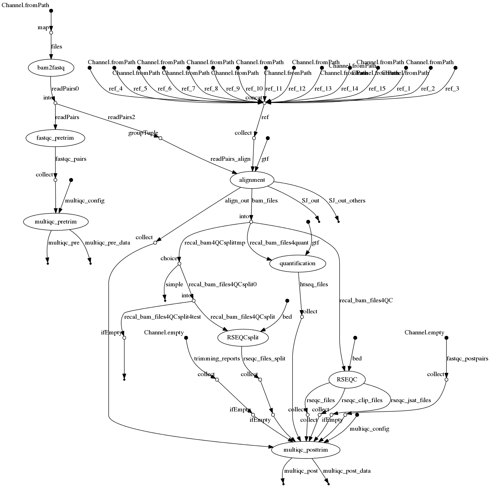
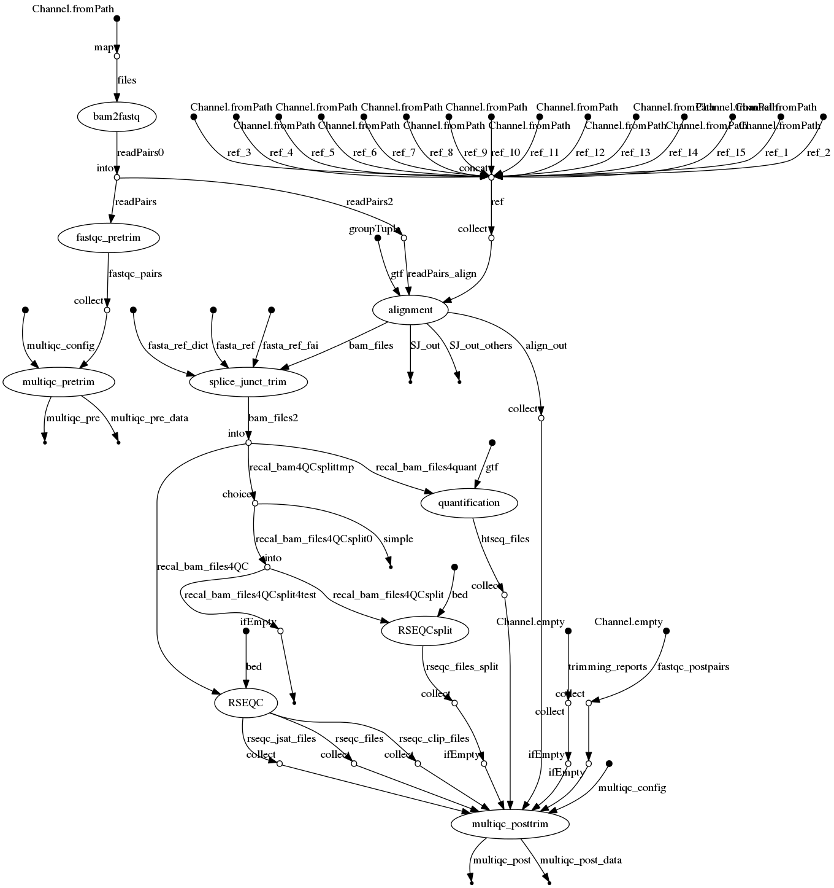

# RNAseq-nf

## Nextflow pipeline for RNA seq processing


## Decription

Nextflow pipeline for RNA sequencing mapping, quality control, reads counting, and unsupervised analysis

## Dependencies

1. Nextflow : for common installation procedures see the [IARC-nf](https://github.com/IARCbioinfo/IARC-nf) repository.

2. [*fastqc*](http://www.bioinformatics.babraham.ac.uk/projects/fastqc/INSTALL.txt)
3. [*cutadapt*](http://cutadapt.readthedocs.io/en/stable/installation.html), which requires Python version > 2.7
4. [*trim_galore*](https://github.com/FelixKrueger/TrimGalore)
5. [*RESeQC*](http://rseqc.sourceforge.net/)
6. [*multiQC*](http://multiqc.info/docs/)
7. [*STAR*](https://github.com/alexdobin/STAR/blob/master/doc/STARmanual.pdf)
8. [*htseq*](http://www-huber.embl.de/HTSeq/doc/install.html#install); the python script htseq-count must also be in the PATH

In addition, STAR requires genome indices that can be generated from a genome fasta file ref.fa and a splice junction annotation file ref.gtf using the following command:
```bash
STAR --runThreadN n --runMode genomeGenerate --genomeDir ref --genomeFastaFiles ref.fa --sjdbGTFfile ref.gtf --sjdbOverhang 99
```

### Alignment with hisat2
In order to perform the optional alignment with hisat2, hisat2 must be installed:
- [*hisat2*](https://ccb.jhu.edu/software/hisat2/index.shtml)

In addition, indexes files *.ht2* must be downloaded from generated from [*hisat2*](https://ccb.jhu.edu/software/hisat2/index.shtml), or generated from a reference fasta file (e.g., reference.fa) and a GTF annotation file (e.g., reference.gtf) using the following commands:
```bash
extract_splice_sites.py reference.gtf > genome.ss
extract_exons.py reference.gtf > genome.exon
hisat2-build reference.fa --ss genome.ss --exon genome.exon genome_tran
```

### Reads trimming at splice junctions
In order to perform the optional reads trimming at splice junctions, GATK must be installed:
- GATK [*GenomeAnalysisTK.jar*](https://software.broadinstitute.org/gatk/guide/quickstart)

In addition, index *.fai* and dictionnary *.dict* must be generated from the fasta reference genome using the following commands:
```bash
samtools faidx ref.fa
java -jar picard.jar CreateSequenceDictionary R= ref.fa O= ref.dict
```

### Base quality score recalibration
- GATK [*GenomeAnalysisTK.jar*](https://software.broadinstitute.org/gatk/guide/quickstart)
- [GATK bundle](https://software.broadinstitute.org/gatk/download/bundle) VCF files with lists of indels and SNVs (recommended: 1000 genomes indels, Mills gold standard indels VCFs, dbsnp VCF)
- bed file with intervals to be considered

## Input 
 | Type      | Description     |
  |-----------|---------------|
  | --input_folder    | a folder with fastq files or bam files |


## Parameters

* #### Mandatory
| Name | Example value | Description |
|-----------|--------------:|-------------| 
| --input_folder | . | input folder |
|--ref_folder | ref | reference genome folder |
|--annot_gtf   |  Homo_sapiens.GRCh38.79.gtf | annotation GTF file |
|--bed   |  gene.bed | bed file with genes for RESeQC | 

* #### Optional

| Name | Default value | Description |
|-----------|--------------|-------------| 
|--cpu          | 4 | number of CPUs |
|--mem         | 50 | memory for mapping|
|--memOther     | 2 | memory for QC and counting|
|--fastq_ext    | fq.gz | extension of fastq files|
|--suffix1      | \_1 | suffix for second element of read files pair|
|--suffix2      | \_2 | suffix for second element of read files pair|
|--output_folder   | . | output folder for aligned BAMs|
|--ref |    ref.fa | reference genome fasta file for GATK |
|--GATK_jar |  GenomeAnalysisTK.jar | path to jar file GenomeAnalysisTK.jar |
|--GATK_bundle |  GATK_bundle | folder with files for BQSR |
|--RG          |  PL:ILLUMINA | string to be added to read group information in BAM file |
|--stranded   |  no | Strand information for counting with htseq [no, yes, reverse] | 
|--hisat2_idx   |  genome_tran | index filename prefix for hisat2 | 

* #### Flags

| Name  | Description |
|-----------|-------------| 
| --help | print usage and optional parameters |
|--sjtrim   | enable reads trimming at splice junctions | 
|--hisat2   | use hisat2 instead of STAR for mapping | 
|--recalibration  | perform quality score recalibration (GATK)|
|--clustering  | perform unsupervised analyses of read counts data|


## Usage
To run the pipeline on a series of paired-end fastq files (with suffixes *_1* and *_2*) in folder *fastq*, and a reference genome with indexes in folder *ref_genome*, one can type:
```bash
nextflow run iarcbioinfo/RNAseq-nf --input_folder fastq --ref_folder ref_genome --suffix1 _1 --suffix2 _2
``` 
### Use hisat2 for mapping
To use hisat2 instead of STAR for the reads mapping, you must add the ***--hisat2* option**, specify the path to the folder containing the hisat2 index files, as well as satisfy the requirements above mentionned. For example:
```bash
nextflow run iarcbioinfo/RNAseq-nf --input_folder fastq --suffix1 _1 --suffix2 _2 --hisat2 --hisat2_idx /home/user/reference/genome_tran 
```
### Enable reads trimming at splice junctions
To use the reads trimming at splice junctions step, you must add the ***--sjtrim* option**, specify the path to the folder containing the GenomeAnalysisTK jar file, as well as satisfy the requirements above mentionned. For example:
```bash
nextflow run iarcbioinfo/RNAseq-nf --input_folder fastq --ref_folder ref_genome --suffix1 _1 --suffix2 _2 --sjtrim --GATK_jar /home/user/GATK/GenomeAnalysisTK.jar
```

### Enable Base Quality Score Recalibration
To use the base quality score recalibration step, you must add the ***--bqsr* option**, specify the path to the folder containing the GenomeAnalysisTK jar file, the path to the GATK bundle folder for your reference genome, specify the path to the bed file with intervals to be considered, as well as satisfy the requirements above mentionned. For example:
```bash
nextflow run iarcbioinfo/RNAseq-nf --input_folder fastq --ref_folder ref_genome --suffix1 _1 --suffix2 _2 --recalibration --GATK_jar /home/user/GATK/GenomeAnalysisTK.jar --GATK_bundle /home/user/GATKbundle --bed intervals.bed
```

## Output 
  | Type      | Description     |
  |-----------|---------------|
  | file.bam    | BAM files of alignments or realignments |
  | file.bam.bai    | BAI files of alignments or realignments |
  | file_{12}.fq.gz_trimming_report.txt | trim_galore report | 
  |multiqc_pretrim_report.html  | multiqc report before trimming | 
  |multiqc_pretrim_report_data            | folder with data used to compute multiqc report before trimming |
  |multiqc_posttrim_report.html      |     multiqc report before trimming | 
  |multiqc_posttrim_report_data      |  folder with data used to compute multiqc report before trimming |
  |STAR.file.Log.final.out| STAR log |
  |file_readdist.txt                | RSeQC report |
  |file_count.txt                   | htseq-count output file  |
  | file_target_intervals.list    | list of intervals used  |
  | file_recal.table | table of scores before recalibration   |
  | file_post_recal.table   | table of scores after recalibration |
  | file_recalibration_plots.pdf   |  before/after recalibration plots   |
          

## Directed Acyclic Graph

### With default options
[](http://htmlpreview.github.io/?https://github.com/IARCbioinfo/RNAseq-nf/blob/dev/dag_STAR.html)

### With option --sjtrim
[](http://htmlpreview.github.io/?https://github.com/IARCbioinfo/RNAseq-nf/blob/dev/dag_STAR_sjtrim.html)

### With option --hisat2
[](http://htmlpreview.github.io/?https://github.com/IARCbioinfo/RNAseq-nf/blob/dev/dag_hisat2.html)


## Contributions

  | Name      | Email | Description     |
  |-----------|---------------|-----------------| 
  | Nicolas Alcala*    | AlcalaN@fellows.iarc.fr    | Developer to contact for support |
  | Noemie Leblay | LeblayN@students.iarc.fr | Tester |
  | Alexis Robitaille | RobitailleA@students.iarc.fr | Tester |
  

